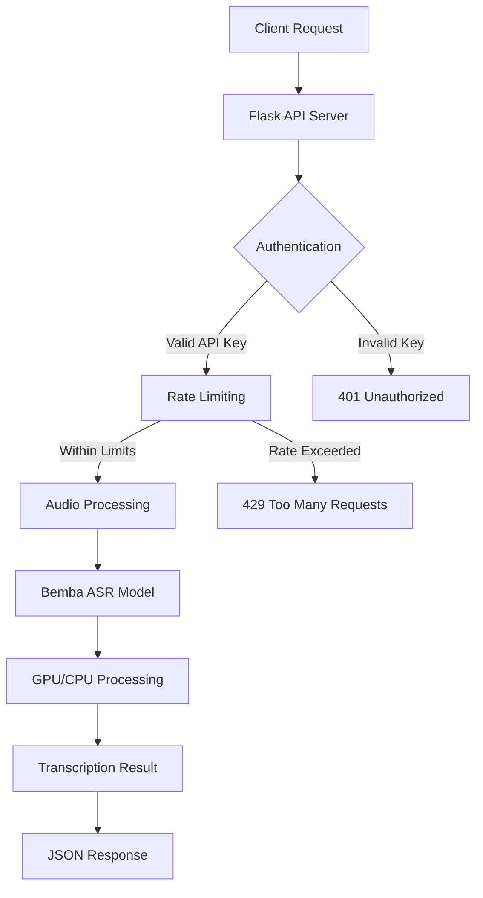

# 🎤 Bemba Automatic Speech Recognition API

[](https://www.python.org/downloads/)
[](https://flask.palletsprojects.com/)
[](LICENSE)
[](https://api.nextinnomind.me)

> A high-performance Flask-based web server providing real-time Automatic Speech Recognition for the Bemba language using state-of-the-art AI models.

## ✨ Features

- **🗣️ Bemba ASR**: Advanced speech-to-text transcription using the `NextInnoMind/next_bemba_ai` model
- **🔐 Secure Authentication**: API key-based authentication system
- **⚡ Rate Limiting**: Built-in protection against abuse with configurable limits
- **🚀 GPU Acceleration**: Automatic NVIDIA GPU detection for lightning-fast processing
- **🔄 Concurrent Processing**: Multi-worker Gunicorn setup for handling multiple requests
- **📁 Flexible Input**: Support for both file uploads and URL-based audio processing
- **💚 Health Monitoring**: Built-in health check endpoints for system monitoring

## 🏗️ Architecture



## 📋 Prerequisites

Ensure you have the following installed:

| Requirement | Version | Purpose |
|------------|---------|---------|
| **Python** | 3.8+ | Runtime environment |
| **pip** | Latest | Package management |
| **git** | Latest | Repository cloning |
| **virtualenv** | Latest | Dependency isolation |
| **CUDA** | 11.0+ (optional) | GPU acceleration |

## 🚀 Quick Start

### 1. Clone the Repository

```bash
git clone https://github.com/SilasChalwe/farmvoiceassistant_backend.git
cd farmvoiceassistant_backend
```

### 2. Set up Virtual Environment

```bash
# Create virtual environment
python -m venv venv

# Activate (Linux/macOS)
source venv/bin/activate

# Activate (Windows)
venv\Scripts\activate
```

### 3. Install Dependencies

```bash
# Core dependencies
pip install Flask gunicorn torch transformers Flask-Cors

# For GPU support (optional but recommended)
pip install torch torchvision torchaudio --index-url https://download.pytorch.org/whl/cu118
```

### 4. Configure Environment Variables

```bash
export MAX_FILE_SIZE_MB=100
export MODEL_NAME=NextInnoMind/next_bemba_ai
export RATE_LIMIT_REQUESTS=10
export RATE_LIMIT_WINDOW=60
```

### 5. Start the Server

```bash
./start_app.sh
```

🎉 **Server is now running at `http://0.0.0.0:5000`**

## 🔧 Configuration Options

| Variable | Default | Description |
|----------|---------|-------------|
| `MAX_FILE_SIZE_MB` | 100 | Maximum upload size in MB |
| `MODEL_NAME` | `NextInnoMind/next_bemba_ai` | Hugging Face model identifier |
| `RATE_LIMIT_REQUESTS` | 10 | Requests per time window |
| `RATE_LIMIT_WINDOW` | 60 | Time window in seconds |

## 📚 API Documentation

### Authentication

All API requests require an `X-API-Key` header with a valid API key.

### Endpoints Overview

| Endpoint | Method | Purpose | Auth Required |
|----------|--------|---------|---------------|
| `/api/generate-key` | POST | Generate API key | ❌ |
| `/transcribe` | POST | Upload & transcribe file | ✅ |
| `/transcribe_url` | POST | Transcribe from URL | ✅ |
| `/health` | GET | Health check | ❌ |
| `/` | GET | Web interface | ❌ |

### 🔑 Generate API Key

```bash
curl -X POST http://localhost:5000/api/generate-key
```

**Response:**
```json
{
  "success": true,
  "message": "API key generated successfully. Please store it securely.",
  "api_key": "550e8400-e29b-41d4-a716-446655440000abc123def456",
  "note": "This is the only time the API key will be shown."
}
```

> ⚠️ **Important**: Each IP address can only generate one API key. Store your key securely as it won't be shown again!

### 📁 Transcribe Audio File

```bash
curl -X POST http://localhost:5000/transcribe \
  -H "X-API-Key: YOUR_API_KEY_HERE" \
  -F "file=@/path/to/audio.wav"
```

### 🌐 Transcribe from URL

For URL transcription, the response includes the source URL:

```bash
curl -X POST http://localhost:5000/transcribe_url \
  -H "Content-Type: application/json" \
  -H "X-API-Key: YOUR_API_KEY_HERE" \
  -d '{"audio_url": "https://example.com/audio.mp3"}'
```

**URL Response Format:**
```json
{
  "text": "Transcribed text in Bemba",
  "language": "bemba",
  "timestamps": [
    {
      "timestamp": [0.0, 5.2],
      "text": "First segment of transcribed text"
    }
  ],
  "success": true,
  "source_url": "https://example.com/audio.mp3",
  "processing_time_seconds": 3.45
}
```

**Response Format:**
```json
{
  "text": "Transcribed text in Bemba",
  "language": "bemba",
  "timestamps": [
    {
      "timestamp": [0.0, 5.2],
      "text": "First segment of transcribed text"
    },
    {
      "timestamp": [5.2, 10.1],
      "text": "Second segment of transcribed text"
    }
  ],
  "success": true,
  "filename": "audio.wav",
  "processing_time_seconds": 2.34
}
```

### 🏥 Health Check

```bash
curl http://localhost:5000/health
```

**Response:**
```json
{
  "status": "healthy",
  "model_status": "ready",
  "gpu_available": true,
  "model": "NextInnoMind/next_bemba_ai",
  "server_type": "Gunicorn Worker"
}
```

## 🌍 Live API

Test the API on our live server:

**Base URL:** `https://api.nextinnomind.me`

```bash
# Generate API key
curl -X POST https://api.nextinnomind.me/api/generate-key

# Transcribe file
curl -X POST https://api.nextinnomind.me/transcribe \
  -H "X-API-Key: YOUR_KEY" \
  -F "file=@audio.wav"
```

## 🛡️ Security Features

- **API Key Authentication**: SHA-256 hashed keys stored securely
- **IP-based Key Generation**: One API key per IP address to prevent abuse
- **Rate Limiting**: Configurable per-user request limits with sliding window
- **File Size Validation**: Configurable upload limits (default: 100MB)
- **Input Sanitization**: Secure filename handling and extension validation
- **Supported Audio Formats**: WAV, MP3, FLAC, OGG, M4A, AAC

## 🚀 Performance Optimization

- **GPU Acceleration**: Automatic NVIDIA CUDA detection and utilization
- **Multi-worker Processing**: Concurrent request handling with Gunicorn
- **Chunked Processing**: 30-second audio chunks for memory efficiency
- **Model Caching**: One-time model initialization per worker process
- **Thread-safe Operations**: Concurrent request handling with proper locking
- **Atomic File Operations**: Safe API key storage with temporary files
- **Memory Management**: Automatic cleanup of temporary audio files

## 📊 Monitoring & Logging

- **Comprehensive Logging**: All activities logged to `app.log` with timestamps
- **Health Endpoints**: Monitor model status, GPU availability, and server health
- **Process Management**: PID tracking in `gunicorn.pid` for process control
- **Error Tracking**: Detailed error logging with stack traces for debugging
- **Rate Limit Monitoring**: Automatic cleanup of expired rate limit entries
- **API Key Management**: Secure storage in `.apikey` file with corruption recovery

## 🐛 Troubleshooting

### Common Issues

| Issue | Solution |
|-------|----------|
| **CUDA not detected** | Install CUDA-enabled PyTorch: `pip install torch --index-url https://download.pytorch.org/whl/cu118` |
| **Model loading fails** | Check internet connection and verify model name `NextInnoMind/next_bemba_ai` |
| **Rate limit exceeded (429)** | Wait for rate limit window to reset or contact admin for limit increase |
| **File too large (413)** | Reduce file size or increase `MAX_FILE_SIZE_MB` environment variable |
| **Unsupported format** | Convert to supported formats: WAV, MP3, FLAC, OGG, M4A, or AAC |
| **API key exists (409)** | Each IP can only generate one key. Use existing key or contact admin |

### Debug Mode

```bash
# Enable debug logging
export FLASK_DEBUG=1
python app.py
```

## 🤝 Contributing

We welcome contributions! Please follow these steps:

1. Fork the repository
2. Create a feature branch (`git checkout -b feature/amazing-feature`)
3. Commit changes (`git commit -m 'Add amazing feature'`)
4. Push to branch (`git push origin feature/amazing-feature`)
5. Open a Pull Request

## 📄 License

This project is licensed under the MIT License - see the [LICENSE](LICENSE) file for details.

## 🙏 Acknowledgments

- **NextInnoMind** for the Bemba ASR model
- **Hugging Face** for the transformers library
- **Flask** community for the excellent web framework

## 📞 Support

- **Issues**: [GitHub Issues](https://github.com/SilasChalwe/farmvoiceassistant_backend/issues)
- **Discussions**: [GitHub Discussions](https://github.com/SilasChalwe/farmvoiceassistant_backend/discussions)
- **Email**: support@nextinnomind.me

---

<div align="center">

**Made with ❤️ for the Bemba-speaking community**

[🌐 Live Demo](https://api.nextinnomind.me) • [📖 Documentation](https://github.com/SilasChalwe/farmvoiceassistant_backend) • [🐛 Report Bug](https://github.com/SilasChalwe/farmvoiceassistant_backend/issues)

</div>